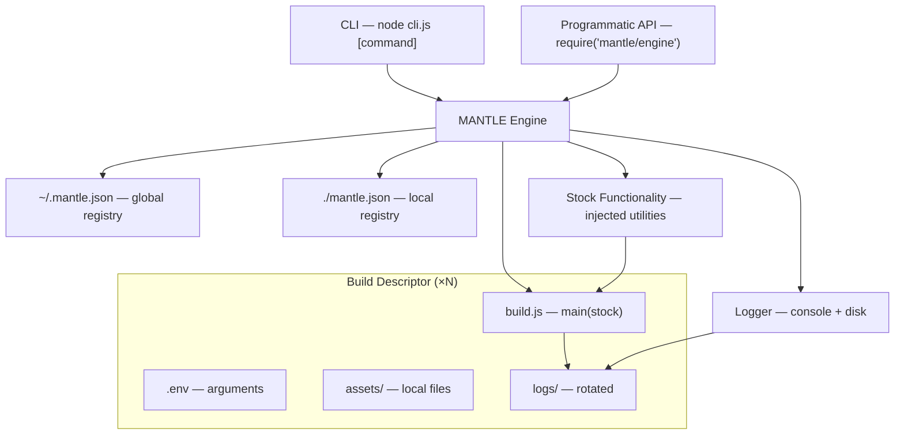
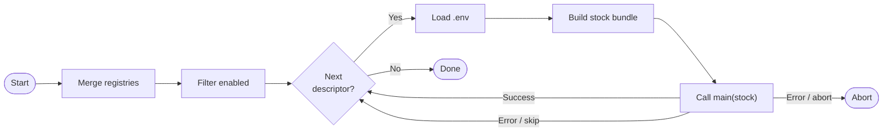

# MANTLE
### Modular Automation eNgine for Task and Lifecycle Execution

> Node.js build orchestration engine with CLI scaffolding, descriptor-based task registry, and built-in logging.

---

## Table of Contents

- [Overview](#overview)
- [Architecture](#architecture)
- [Installation](#installation)
- [Quick Start](#quick-start)
- [Build Descriptors](#build-descriptors)
- [The Engine](#the-engine)
- [Stock Functionality](#stock-functionality)
- [Path Resolution](#path-resolution)
- [CLI Reference](#cli-reference)
- [Programmatic Usage](#programmatic-usage)
- [Registry](#registry)
- [Logging](#logging)
- [Configuration](#configuration)

---

## Overview

MANTLE is a lightweight, Node.js-based build orchestration engine. It manages an ordered registry of **build descriptors** — self-contained folders that each define their own environment, local assets, and build logic. The engine runs them in sequence, injecting stock utilities into each descriptor's `build.js`, and produces structured console and disk logs throughout.

MANTLE is intentionally generic. It does not care what your build descriptors do — compile code, transform files, call APIs, provision infrastructure. If it can be expressed in Node.js, a descriptor can do it.

---

## Architecture



The engine reads and merges the global and local registries, resolves each enabled descriptor in order, loads its environment, and calls its `main` function — passing in the stock utility bundle. Descriptors run sequentially; on error, the engine either skips to the next or aborts, depending on configuration.

---

## Installation

MANTLE is not yet published to npm. Clone the repository and invoke the CLI directly:

```bash
git clone https://github.com/ciacob/mantle.git
node /path/to/mantle/cli.js <command>
```

To avoid typing the full path each time, add a shell alias or symlink:

```bash
# Alias (add to ~/.zshrc or ~/.bashrc)
alias mantle="node /path/to/mantle/cli.js"

# Or symlink
ln -s /path/to/mantle/cli.js /usr/local/bin/mantle
chmod +x /usr/local/bin/mantle
```

Use `--cwd` when invoking from a different directory than your project root:

```bash
node /path/to/mantle/cli.js run --cwd /path/to/my-project
```

---

## Quick Start

**1. Create a local registry in your project:**

```bash
node /path/to/mantle/cli.js init
# Creates ./mantle.json
```

**2. Scaffold a new build descriptor:**

```bash
node /path/to/mantle/cli.js new my-first-build --path ./descriptors
```

**3. Fill in `descriptors/my-first-build/.env` and write your logic in `build.js`.**

**4. Enable and run:**

```bash
node /path/to/mantle/cli.js enable my-first-build
node /path/to/mantle/cli.js run
```

---

## Build Descriptors

A build descriptor is a folder with a defined structure:

```
my-descriptor/
├── .env                  # Environment variables / arguments
├── assets/               # Files that ship with this descriptor (icons, templates, …)
│   └── ...
├── build.js              # Entry point — must export an async `main` function
└── logs/                 # Auto-created by the engine; add to .gitignore
```

### `.env`

Standard dotenv-style key-value pairs. The engine loads the file before calling `main`,
then merges it with the shell environment — **shell values take precedence over `.env`
values**, so credentials can be set in the shell or CI without modifying the file.

```dotenv
# Paths relative to cwd (resolved by stock.resolvePath)
SOURCE_DIR=../my-app
OUTPUT_DIR=./dist

# Files relative to assets/ (resolved by stock.resolveAssetPath)
APP_ICON=MyApp.icns

# Leave sensitive values blank — set them in the shell instead
APPLE_PASSWORD=
```

### `assets/`

Files that ship with the descriptor — icons, templates, config snippets. Place them here
and reference them by filename via `stock.resolveAssetPath`. Arbitrary nesting is supported.

### `build.js`

The descriptor's entry point. Must export an async `main(stock)` function.

```js
'use strict';

module.exports = {
  async main(stock) {
    const { log, env, readAsset, shell, fs, path } = stock;

    log.info('Starting build…');

    const sourceDir = stock.resolvePath('SOURCE_DIR');      // relative to cwd
    const iconPath  = stock.resolveAssetPath('APP_ICON');   // relative to assets/
    const template  = readAsset('Info.plist.template');     // reads from assets/

    await shell(`cp "${iconPath}" "${sourceDir}/icon.icns"`);

    log.info('Done.');
  },
};
```

---

## The Engine

The engine:

1. Loads and merges `~/.mantle.json` (global) and `./mantle.json` (local). Local config values override global ones; descriptors from both registries are concatenated (global first).
2. Filters to enabled entries only (or the named entry if `--only` / `mantle run <name>`).
3. For each descriptor, in order:
   - Loads `.env`, merging with the shell environment (shell wins).
   - Constructs the stock utility bundle, scoped to the descriptor.
   - Calls `main(stock)` from `build.js`.
   - Writes structured logs to the descriptor's `logs/` folder.
4. On error: skips and continues, or aborts — depending on `onError`.



---

## Stock Functionality

The stock bundle is injected into every `main(stock)` call. It provides common utilities so descriptors stay focused on their own logic.

| Utility | Description |
|---|---|
| `log` | Scoped logger: `.info(msg)`, `.warn(msg)`, `.error(msg)`, `.debug(msg)`. Writes to console and `logs/`. |
| `env` | Parsed `.env` values merged with shell environment, as a plain object. |
| `readAsset(relativePath, [opts])` | Read a file from `assets/`. Returns a string by default; pass `{ binary: true }` or `{ encoding: null }` for a `Buffer`. |
| `shell(command, [opts])` | Run a shell command synchronously. Returns trimmed stdout. Throws on non-zero exit. Accepts `{ cwd, env }`. |
| `resolvePath(envKey)` | Resolve an env variable to an absolute path, anchored to **cwd**. See [Path Resolution](#path-resolution). |
| `resolveAssetPath(envKey)` | Resolve an env variable to an absolute path, anchored to **`assets/`**. See [Path Resolution](#path-resolution). |
| `paths` | `{ root, assets, logs }` — absolute paths for the descriptor's key directories. |
| `fs` | `node:fs/promises` — re-exported for convenience. |
| `path` | `node:path` — re-exported for convenience. |

---

## Path Resolution

Resolving paths from env variables correctly is one of the most common sources of bugs in
build scripts. MANTLE provides two stock methods that handle this uniformly so descriptors
never need to call `path.resolve` or `process.cwd()` manually.

### `stock.resolvePath(envKey)`

For paths that live **outside** the descriptor — source projects, output directories,
external tool locations. Relative values are resolved against the directory where
`mantle run` is invoked (the working directory).

```js
const sourceDir = stock.resolvePath('SOURCE_DIR');
// .env: SOURCE_DIR=../my-app  →  /project/my-app   (relative to cwd)
// .env: SOURCE_DIR=/abs/path  →  /abs/path          (absolute, unchanged)
```

### `stock.resolveAssetPath(envKey)`

For files that **ship with the descriptor** — icons, templates, configs. Relative values
are resolved against the descriptor's `assets/` folder. Users can drop files into `assets/`
and reference them by filename only.

```js
const iconPath = stock.resolveAssetPath('APP_ICON');
// .env: APP_ICON=MyApp.icns        →  /descriptor/assets/MyApp.icns
// .env: APP_ICON=/abs/icon.icns    →  /abs/icon.icns   (absolute, unchanged)
```

### Behaviour common to both

- **Absolute paths pass through unchanged.** Both methods detect absolute paths and return them as-is, so users can always override with a full path when needed.
- **Empty variables throw immediately.** If the env variable is empty or undefined, the method throws a clear error naming the variable — you get an actionable message rather than a cryptic `ENOENT` somewhere downstream.
- **Shell env takes precedence over `.env` file.** Set sensitive or machine-specific values in the shell; leave them blank in `.env`.

### Anti-pattern to avoid

Do not resolve paths manually in your `build.js`:

```js
// ✗ Fragile — breaks when --cwd is used or the descriptor is moved
const iconPath = path.resolve(env.APP_ICON);
const iconPath = path.resolve(process.cwd(), env.APP_ICON);
```

```js
// ✓ Correct — always resolves against the right base
const iconPath = stock.resolveAssetPath('APP_ICON');
const sourceDir = stock.resolvePath('SOURCE_DIR');
```

---

## CLI Reference

```
node /path/to/mantle/cli.js <command> [options]
```

| Command | Description |
|---|---|
| `init [--global]` | Create an empty registry (`./mantle.json` or `~/.mantle.json`). |
| `new <name> [--path <dir>] [--global]` | Scaffold a new descriptor and register it (disabled by default). |
| `list` | Show all registered descriptors with order and enabled/disabled status. |
| `enable <name> [--global]` | Enable a descriptor by name. |
| `disable <name> [--global]` | Disable a descriptor (skipped at runtime; stays registered). |
| `move <name> up\|down [--global]` | Reorder a descriptor in the run sequence. |
| `run [<name>] [--on-error skip\|abort]` | Run all enabled descriptors, or one by name. |

### Global flags

| Flag | Description |
|---|---|
| `--cwd <dir>` | Treat `<dir>` as the working directory for registry lookup and path resolution. Useful when mantle is not on PATH and you invoke it from a different directory. |
| `--global` | Write registry mutations to `~/.mantle.json` instead of `./mantle.json`. |
| `--on-error skip\|abort` | Override the `onError` config for this run only. |

### Registry lookup order

For every command, mantle looks for registries in this order:

1. `<cwd>/mantle.json` — local registry
2. `~/.mantle.json` — global registry

Both are loaded and merged when present. If neither exists, mantle exits with a clear error. Run `mantle init` to create one.

---

## Programmatic Usage

```js
const mantle = require('./engine/index');

// Run all enabled descriptors
await mantle.run();

// Run from a specific directory
await mantle.run({ cwd: '/path/to/project' });

// Run with explicit error behaviour
await mantle.run({ onError: 'abort' });

// Run a single descriptor by name
await mantle.run({ only: 'my-descriptor' });

// Inspect the merged registry without running
const { registry } = mantle.load({ cwd: '/path/to/project' });

// Mutate the local registry
mantle.registry.add({ name: 'x', path: '/abs/path', enabled: false });
mantle.registry.enable('x');
mantle.registry.move('x', 'up');

// Mutate the global registry
mantle.registry.enable('x', { global: true });
```

---

## Registry

MANTLE uses two registry files, merged at runtime:

| File | Purpose |
|---|---|
| `~/.mantle.json` | Global registry — defaults and descriptors relevant across projects |
| `./mantle.json` | Local registry — project-specific descriptors and config overrides |

Both are plain JSON files and can be edited directly (MANTLE validates them on load). Local config values override global ones. Descriptors from both files are concatenated — global descriptors run before local ones.

```json
{
  "config": {
    "onError": "skip",
    "logLevel": "info"
  },
  "descriptors": [
    {
      "name": "my-descriptor",
      "path": "./descriptors/my-descriptor",
      "enabled": true
    }
  ]
}
```

Descriptor `path` values may be absolute or relative. Relative paths are resolved against the directory containing the registry file they appear in.

---

## Logging

Each descriptor has its own `logs/` subfolder. Log entries are written by the engine and by anything called through `stock.log`.

```
my-descriptor/
└── logs/
    ├── build-2024-11-01.log
    ├── build-2024-11-02.log
    └── build-2024-11-03.log      ← current
```

Log files rotate daily. Older files are retained for `logRetentionDays` days (default: 14). Entries are structured:

```
[2024-11-03 09:14:22] [INFO ] [my-descriptor] Starting build…
[2024-11-03 09:14:23] [INFO ] [my-descriptor] Done.
[2024-11-03 09:15:01] [ERROR] [other-desc]    Connection refused
```

Console output mirrors disk output, with ANSI colour when a TTY is detected.

---

## Configuration

Add a `config` key to either registry file. Local values override global ones.

```json
{
  "config": {
    "onError": "skip",
    "logRetentionDays": 14,
    "logLevel": "info"
  }
}
```

| Key | Default | Values | Description |
|---|---|---|---|
| `onError` | `"skip"` | `"skip"` / `"abort"` | What to do when a descriptor fails. Overridden by `--on-error`. |
| `logRetentionDays` | `14` | positive integer | Daily log files older than this are deleted on the next run. |
| `logLevel` | `"info"` | `"debug"` / `"info"` / `"warn"` / `"error"` | Minimum level to emit to console and disk. |

---

## License

Apache 2.0
