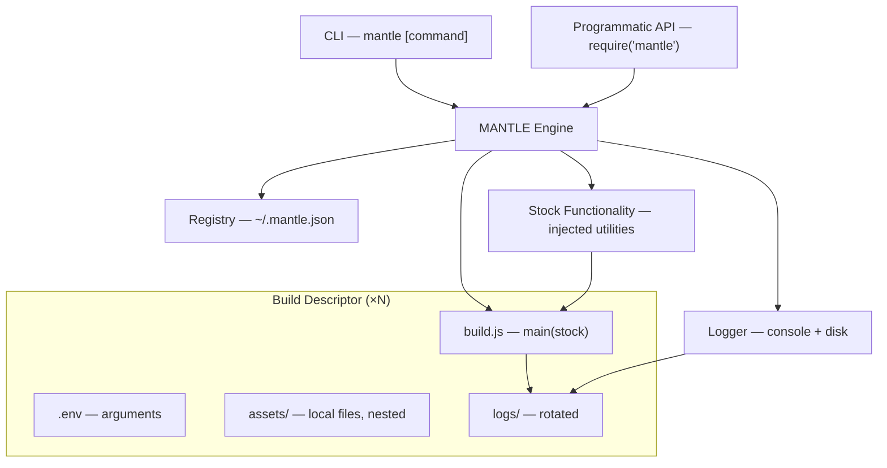

# MANTLE
### Modular Automation eNgine for Task and Lifecycle Execution

> Node.js build orchestration engine with CLI scaffolding, descriptor-based task registry, and built-in logging.

---

## Table of Contents

- [Overview](#overview)
- [Architecture](#architecture)
- [Installation](#installation)
- [Quick Start](#quick-start)
- [Build Descriptors](#build-descriptors)
- [The Engine](#the-engine)
- [Stock Functionality](#stock-functionality)
- [CLI Reference](#cli-reference)
- [Programmatic Usage](#programmatic-usage)
- [Registry](#registry)
- [Logging](#logging)
- [Configuration](#configuration)

---

## Overview

MANTLE is a lightweight, Node.js-based build orchestration engine. It manages an ordered registry of **build descriptors** — self-contained folders that each define their own environment, local assets, and build logic. The engine runs them in sequence, injecting stock utilities into each descriptor's `build.js`, and produces structured console and disk logs throughout.

MANTLE is intentionally generic. It does not care what your build descriptors do — compile code, transform files, call APIs, provision infrastructure. If it can be expressed in Node.js, a descriptor can do it.

---

## Architecture



The engine reads the registry, resolves each enabled descriptor in order, loads its environment, and calls its `main` function — passing in the stock utility bundle. Descriptors run sequentially; on error, the engine either skips to the next or aborts all subsequent entries, depending on configuration.

---

## Installation

```bash
npm install -g mantle
```

Or as a project dependency:

```bash
npm install mantle
```

---

## Quick Start

**1. Scaffold a new build descriptor:**

```bash
mantle new my-first-build --path ./descriptors
```

**2. Edit the generated files** (see [Build Descriptors](#build-descriptors) below).

**3. Run all enabled descriptors:**

```bash
mantle run
```

---

## Build Descriptors

A build descriptor is a folder with a defined structure:

```
my-descriptor/
├── .env                  # Environment variables / arguments
├── assets/               # Local assets (arbitrary nesting supported)
│   └── ...
├── build.js              # Entry point — must export a `main` function
└── logs/                 # Auto-created by the engine; do not commit
```

### `.env`

Standard dotenv-style key-value pairs. Loaded automatically by the engine before `main` is called, and available via `process.env` inside `build.js`.

```dotenv
OUTPUT_DIR=./dist
TARGET_ENV=production
RETRY_COUNT=3
```

### `assets/`

An arbitrary folder of local files your build needs — templates, configs, data files, etc. Nesting is fully supported. Reference them relative to the descriptor root inside `build.js`.

### `build.js`

The descriptor's entry point. Must export an async `main` function. The engine calls it with the [stock utility bundle](#stock-functionality) as its only argument.

```js
// build.js
module.exports = {
  async main(stock) {
    const { log, readAsset, shell, env } = stock;

    log.info('Starting my build...');

    const template = await readAsset('assets/template.html');
    await shell(`cp ${template} ${env.OUTPUT_DIR}`);

    log.info('Done.');
  }
};
```

---

## The Engine

The engine is the core of MANTLE. It:

1. Reads `~/.mantle.json` to obtain the ordered list of descriptors.
2. Filters to enabled entries only.
3. For each descriptor, in order:
   - Loads `.env` into `process.env`.
   - Constructs the stock utility bundle, scoped to the descriptor.
   - Calls `main(stock)` from `build.js`.
   - Writes structured logs to the descriptor's `logs/` folder.
4. On error: skips the failed descriptor and continues, or aborts all subsequent descriptors — depending on the `onError` setting.


---

## Stock Functionality

The stock bundle is injected into every `build.js` `main` call. It provides common utilities so descriptors stay focused on their own logic.

| Utility | Description |
|---|---|
| `log` | Scoped logger (`.info`, `.warn`, `.error`, `.debug`). Writes to console and the descriptor's `logs/` folder. |
| `env` | Parsed `.env` values for this descriptor, as a plain object. |
| `readAsset(relativePath)` | Reads a file from the descriptor's `assets/` folder. Returns a string by default. |
| `shell(command)` | Runs a shell command; returns stdout. Throws on non-zero exit. |
| `paths` | Resolved absolute paths for the descriptor root, assets folder, and logs folder. |

All stock utilities are scoped to the descriptor currently running. Logs written via `stock.log` are automatically tagged and routed to the correct `logs/` folder.

---

## CLI Reference

```
mantle <command> [options]
```

| Command | Description |
|---|---|
| `mantle new <name>` | Scaffold a new build descriptor at the given location. |
| `mantle list` | List all registered descriptors, their order, and enabled/disabled status. |
| `mantle enable <name>` | Enable a descriptor by name. |
| `mantle disable <name>` | Disable a descriptor by name (skipped at runtime; stays in registry). |
| `mantle move <name> up` | Move a descriptor one position earlier in the run order. |
| `mantle move <name> down` | Move a descriptor one position later in the run order. |
| `mantle run` | Run all enabled descriptors in order. |
| `mantle run <name>` | Run a single descriptor by name, regardless of enabled status. |
| `mantle run --on-error skip` | Run all; log errors and continue with subsequent descriptors. |
| `mantle run --on-error abort` | Run all; abort all subsequent descriptors on first error. |

### `mantle new`

```bash
mantle new <name> [--path <dir>]
```

Scaffolds a new descriptor folder containing a starter `.env`, an empty `assets/` subfolder, and a `build.js` template. Registers the descriptor in `~/.mantle.json` (disabled by default).

### `mantle list`

```
$ mantle list

  #   Name                  Status
  ─────────────────────────────────
  1   compile-frontend      enabled
  2   generate-docs         enabled
  3   notify-slack          disabled
  4   deploy-staging        enabled
```

### `mantle run <name>`

```bash
mantle run <name>
```

Runs a single named descriptor directly, bypassing the registry run order and ignoring its enabled/disabled status. Useful for testing a descriptor in isolation or re-running a failed step without triggering the full pipeline. Respects `--on-error` for consistency, though it has no effect when only one descriptor is targeted.

---

## Programmatic Usage

MANTLE exposes its engine as a Node.js module, so it can be embedded in larger toolchains.

```js
const mantle = require('mantle');

// Run all enabled descriptors
await mantle.run();

// Run with explicit error behaviour
await mantle.run({ onError: 'abort' });

// Run a specific subset by name
await mantle.run({ only: ['compile-frontend', 'generate-docs'] });

// Access the registry programmatically
const registry = await mantle.registry.load();
await mantle.registry.enable('deploy-staging');
await mantle.registry.move('deploy-staging', 'up');
```

---

## Registry

MANTLE keeps its descriptor registry at:

```
~/.mantle.json
```

This is a plain JSON file and can be edited directly. The schema is straightforward:

```json
{
  "descriptors": [
    {
      "name": "compile-frontend",
      "path": "/home/user/builds/compile-frontend",
      "enabled": true
    },
    {
      "name": "generate-docs",
      "path": "/home/user/builds/generate-docs",
      "enabled": true
    },
    {
      "name": "notify-slack",
      "path": "/home/user/builds/notify-slack",
      "enabled": false
    }
  ]
}
```

Order in the array is run order. MANTLE respects direct edits to this file; no sync step is needed.

---

## Logging

Each descriptor has its own `logs/` subfolder, written to automatically by the engine and by anything called through `stock.log`.

```
my-descriptor/
└── logs/
    ├── build-2024-11-01.log
    ├── build-2024-11-02.log
    └── build-2024-11-03.log      ← current
```

Log files rotate daily. Older files are retained according to the `logRetentionDays` setting (default: 14). Log entries are structured:

```
[2024-11-03 09:14:22] [INFO]  [compile-frontend] Starting my build...
[2024-11-03 09:14:23] [INFO]  [compile-frontend] Done.
[2024-11-03 09:15:01] [ERROR] [notify-slack] Connection refused — slack.example.com:443
```

Console output mirrors disk output, with colour formatting when a TTY is detected.

---

## Configuration

Global MANTLE behaviour can be configured by adding a `config` key to `~/.mantle.json`:

```json
{
  "config": {
    "onError": "skip",
    "logRetentionDays": 14,
    "logLevel": "info"
  },
  "descriptors": [ ... ]
}
```

| Key | Default | Description |
|---|---|---|
| `onError` | `"skip"` | `"skip"` or `"abort"`. Default error handling for `mantle run`. Overridden by the `--on-error` CLI flag. |
| `logRetentionDays` | `14` | Number of daily log files to keep per descriptor before rotation discards old ones. |
| `logLevel` | `"info"` | Minimum log level to emit. One of `debug`, `info`, `warn`, `error`. |

---

## License

Apache 2.0
