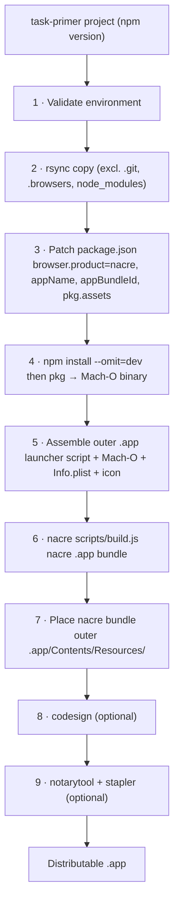

# task-primer-nacre

MANTLE build descriptor that packages a [task-primer](https://github.com/ciacob/task-primer)
project into a distributable macOS `.app` bundle using [nacre](https://github.com/ciacob/nacre)
as the UI layer.

---

## What it does



The outer `.app` contains a thin **launcher shell script** as its executable. The script
always passes `--ui --autoexit` to the Mach-O so clicking the Dock icon starts
task-primer in UI mode and exits cleanly when the window is closed.

```
MyApp.app/
└── Contents/
    ├── Info.plist
    ├── MacOS/
    │   ├── My-App            ← launcher shell script (CFBundleExecutable)
    │   └── My-App-bin        ← the real Mach-O
    └── Resources/
        ├── AppIcon.icns
        └── My App.app/       ← nacre bundle (WKWebView UI layer)
            └── Contents/
                ├── MacOS/nacre
                └── ...
```

---

## No App Store compatibility

**Apps built with this descriptor cannot be submitted to the Mac App Store.**

This is an architectural limitation with no workaround. The pkg-built binary
embeds Node.js and the V8 JavaScript engine, which requires JIT compilation
(`com.apple.security.cs.allow-jit`). The App Store sandbox explicitly prohibits
JIT — apps may not generate and execute code at runtime. All three entitlements
in `assets/entitlements.plist` are similarly prohibited under App Store rules.

This affects any app that embeds a JavaScript runtime (Electron, NW.js, and
similar frameworks face the same restriction).

**What you get instead** is Developer ID distribution with full notarization —
Apple scans the binary for malware, issues a signed ticket, and Gatekeeper
verifies it on every user's machine. For the vast majority of developer tools
and internal applications this is the correct distribution path, and it is
exactly what this pipeline produces.

If App Store distribution is a hard requirement, the architecture would need to
change fundamentally — the Node.js host process would need to be replaced with a
native macOS app, with web functionality confined entirely to WKWebView (which
nacre already provides for the UI layer).

---

## Prerequisites

- macOS 13+
- Xcode Command Line Tools (`xcode-select --install`)
- [nacre](https://github.com/ciacob/nacre) cloned and shim compiled:
  ```bash
  cd /path/to/nacre/shim && swift build -c release
  ```
- `@yao-pkg/pkg` installed globally:
  ```bash
  npm install -g @yao-pkg/pkg
  ```
- task-primer project with `yargs` pinned to exactly `"17.7.2"` — see
  [pkg compatibility notes](#pkg-compatibility-notes) below.
- An Apple Developer account with a Developer ID certificate (for signing + notarization).
  Signing and notarization are optional — the build completes without them, producing an
  unsigned bundle suitable for local testing.

---

## Setup

**1. Copy this descriptor into your project or a descriptors folder:**

```bash
cp -R /path/to/mantle/sample-descriptors/task-primer-nacre ./my-descriptors/
```

**2. Create your `.env` file:**

```bash
cd my-descriptors/task-primer-nacre
cp .env.template .env
```

**3. Fill in `.env`:**

| Variable | Required | Description |
|---|---|---|
| `SOURCE_DIR` | ✓ | Path to the task-primer project root. Relative values resolve against cwd. |
| `APP_NAME` | ✓ | Human-readable app name (e.g. `My App`). Used for the `.app` bundle name, menu bar, and Dock label. Must match `taskPrimer.appName` in the source project's `package.json`. |
| `APP_BUNDLE_ID` | ✓ | Reverse-DNS bundle identifier (e.g. `com.example.myapp`). |
| `APP_VERSION` | ✓ | Version string (e.g. `1.0.0`). |
| `APP_ICON` | ✓ | Path to an `.icns` icon file. Relative values resolve against this descriptor's `assets/` folder — drop the file there and just write the filename. |
| `OUTPUT_DIR` | ✓ | Where the finished `.app` is written. Relative values resolve against cwd. |
| `NACRE_DIR` | ✓ | Path to the nacre repository root. Relative values resolve against cwd. |
| `PKG_BIN` | ✓ | Path to the pkg binary (default: `pkg` if globally installed). |
| `PKG_TARGET` | | pkg target string. Default: `node20-macos-arm64`. The first run builds the Node base binary from source (~10 min); subsequent runs use the pkg cache and are fast. |
| `APPLE_IDENTITY` | | Developer ID Application identity for codesign (e.g. `Developer ID Application: Your Name (TEAMID)`). Leave blank to skip signing. |
| `ENTITLEMENTS_PLIST` | | Path to the entitlements `.plist`. Default: `entitlements.plist` (resolves to `assets/entitlements.plist`). The default grants the JIT entitlement required by V8. Override only if your app needs additional entitlements. |
| `APPLE_ID` | | Apple ID email for notarytool. Leave blank to skip notarization. |
| `APPLE_PASSWORD` | | App-specific password for notarytool. **Set in the shell, never in `.env`.** |
| `APPLE_TEAM_ID` | | Apple Developer Team ID for notarytool. |

**4. Add the descriptor to your MANTLE registry:**

```bash
# From your project root:
node /path/to/mantle/cli.js init          # creates ./mantle.json if needed
```

Then add the entry to `mantle.json`:

```json
{
  "descriptors": [
    {
      "name":    "task-primer-nacre",
      "path":    "./my-descriptors/task-primer-nacre",
      "enabled": true
    }
  ]
}
```

---

## Running

```bash
# Run the full pipeline
node /path/to/mantle/cli.js run

# Run this descriptor alone (useful during development)
node /path/to/mantle/cli.js run task-primer-nacre

# From a different directory
node /path/to/mantle/cli.js run --cwd /path/to/project
```

Output is written to `OUTPUT_DIR/<APP_NAME>.app`.

---

## Sensitive credentials

`APPLE_PASSWORD` should never be stored in `.env`. Set it in your shell before running:

```bash
export APPLE_PASSWORD="xxxx-xxxx-xxxx-xxxx"
node /path/to/mantle/cli.js run
```

Or inject it as a CI secret. dotenv's precedence rule ensures shell values always win over
`.env` file values, so the blank entry in `.env` is safe to commit.

---

## pkg compatibility notes

`@yao-pkg/pkg` (the actively maintained fork of the original `pkg`) snapshots your app
and its dependencies into the Mach-O binary. Several compatibility requirements apply:

**1. Pin `yargs` to exactly `17.7.2`.**

yargs 18+ ships as pure ESM with no CJS fallback. pkg's snapshot filesystem cannot
execute ESM modules, so it fails at startup. yargs 17 is the last version with full
CJS support and an identical API for the patterns task-primer uses.

In your task-primer project's `package.json`:
```json
"yargs": "17.7.2"
```
No caret — exact pin ensures reproducible builds regardless of when `npm install` runs.

**2. Declare all dynamically-loaded paths as `pkg.assets`.**

pkg's static analyser cannot trace `child_process.fork(variable)` or
`require(variable)` calls. The descriptor automatically adds the following to
`pkg.assets` when patching `package.json`:

- `server/**` — the Fastify server process (forked by main)
- `worker/**` — the task worker process (forked by main)
- `shared/**` — IPC message definitions (required by both)
- `ui/**` — static web frontend (served by Fastify)
- `tasks/**` — user task modules (loaded dynamically)

If your project adds other dynamically-loaded files, declare them in the source
project's `package.json` under `pkg.assets` before running the build — the descriptor
merges rather than replaces any existing `pkg.assets` entries.

**4. The hardened runtime requires a JIT entitlement.**

pkg embeds V8 (the Node.js JavaScript engine), which requires writable and
executable memory for JIT compilation. The macOS hardened runtime (enabled by
`--options runtime` during codesign) blocks this by default. Without the
`com.apple.security.cs.allow-jit` entitlement the app crashes immediately on
launch with:

```
Fatal process OOM in Failed to reserve virtual memory for CodeRange
```

The `assets/entitlements.plist` file in this descriptor grants this entitlement
(along with two others required by pkg's snapshot loader). It is applied
automatically to the Mach-O binary and the outer `.app` bundle during signing.
No action required unless your app needs additional entitlements.

pkg downloads and compiles the Node.js base binary from source on first run (~10 min
on Apple Silicon). The result is cached in `~/.pkg-cache`. Subsequent runs are fast.

---

## Bundle identity

`APP_NAME` must match exactly across three places:

1. `taskPrimer.appName` in the source project's `package.json` — task-primer uses this
   to locate the nacre binary at runtime:
   `../Resources/<appName>.app/Contents/MacOS/nacre`

2. The `APP_NAME` variable in this descriptor's `.env` — used to name the nacre bundle
   and the outer `.app`.

3. The nacre `Info.plist` `CFBundleName` — set automatically by the build.

The descriptor patches `taskPrimer.appName` in the copied `package.json` automatically,
so as long as `.env` is correct the three stay in sync.

---

## Add `.env` to `.gitignore`

```bash
echo "my-descriptors/task-primer-nacre/.env" >> .gitignore
```

The `.env.template` file is safe to commit — it documents the required variables
without containing any values.

---

## License

Apache 2.0 — see the [mantle repository](https://github.com/ciacob/mantle).
