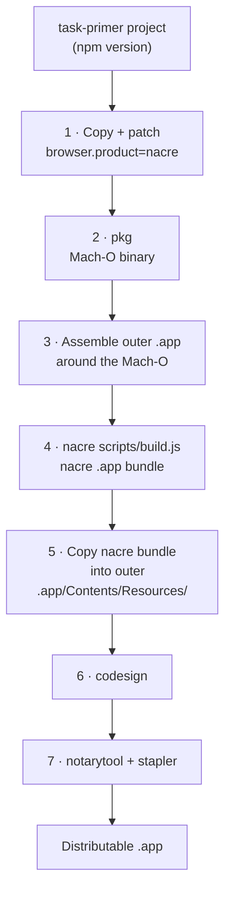

# task-primer-nacre

MANTLE build descriptor that packages a [task-primer](https://github.com/ciacob/task-primer)
project into a distributable macOS `.app` bundle using [nacre](https://github.com/ciacob/nacre)
as the UI layer.

---

## What it does



---

## Prerequisites

- macOS 13+
- Xcode Command Line Tools (`xcode-select --install`)
- [nacre](https://github.com/ciacob/nacre) cloned and shim compiled:
  ```bash
  cd /path/to/nacre/shim && swift build -c release
  ```
- `pkg` installed:
  ```bash
  npm install -g @yao-pkg/pkg
  ```
- An Apple Developer account with a Developer ID certificate (for signing + notarization)

---

## Setup

**1. Copy this descriptor into your project or a descriptors folder:**

```bash
cp -R /path/to/mantle/sample-descriptors/task-primer-nacre ./my-descriptors/
```

**2. Create your `.env` file:**

```bash
cd my-descriptors/task-primer-nacre
cp .env.template .env
```

**3. Fill in `.env`:**

| Variable | Required | Description |
|---|---|---|
| `SOURCE_DIR` | ✓ | Absolute path to the task-primer project root |
| `APP_NAME` | ✓ | Human-readable app name (e.g. `My App`) |
| `APP_BUNDLE_ID` | ✓ | Reverse-DNS bundle ID (e.g. `com.example.myapp`) |
| `APP_VERSION` | ✓ | Version string (e.g. `1.0.0`) |
| `APP_ICON` | ✓ | Path to an `.icns` icon file. Relative paths resolve against `assets/` |
| `OUTPUT_DIR` | ✓ | Where the finished `.app` is written (e.g. `./dist`) |
| `NACRE_DIR` | ✓ | Absolute path to the nacre repository root |
| `PKG_BIN` | ✓ | Path to pkg binary (default: `pkg`) |
| `PKG_TARGET` | | pkg target string (default: `node20-macos-arm64`) |
| `APPLE_IDENTITY` | | Developer ID for codesign (skip to produce unsigned build) |
| `APPLE_ID` | | Apple ID for notarytool (skip to skip notarization) |
| `APPLE_PASSWORD` | | App-specific password — **set in shell, not in .env** |
| `APPLE_TEAM_ID` | | Team ID for notarytool |

**4. Add the descriptor to your MANTLE registry:**

```bash
# From your project root (where mantle.json lives, or will be created):
mantle init                  # creates mantle.json if needed
```

Then add the descriptor entry manually to `mantle.json`:

```json
{
  "descriptors": [
    {
      "name":    "task-primer-nacre",
      "path":    "./my-descriptors/task-primer-nacre",
      "enabled": true
    }
  ]
}
```

Or use the CLI:

```bash
mantle new task-primer-nacre --path ./my-descriptors
# (then replace the scaffolded build.js with this one)
mantle enable task-primer-nacre
```

---

## Running

```bash
# Run the full pipeline
mantle run

# Or run this descriptor alone
mantle run task-primer-nacre
```

Output is written to `OUTPUT_DIR/<AppName>.app`.

---

## Sensitive credentials

`APPLE_PASSWORD` should never be stored in `.env`. Set it in your shell:

```bash
export APPLE_PASSWORD="xxxx-xxxx-xxxx-xxxx"
mantle run
```

Or in CI, inject it as a secret environment variable. dotenv's precedence rule
ensures shell values always win over `.env` file values.

---

## Add `.env` to `.gitignore`

```bash
echo "my-descriptors/task-primer-nacre/.env" >> .gitignore
```
